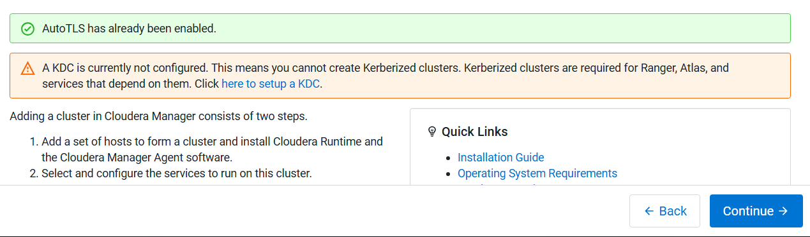
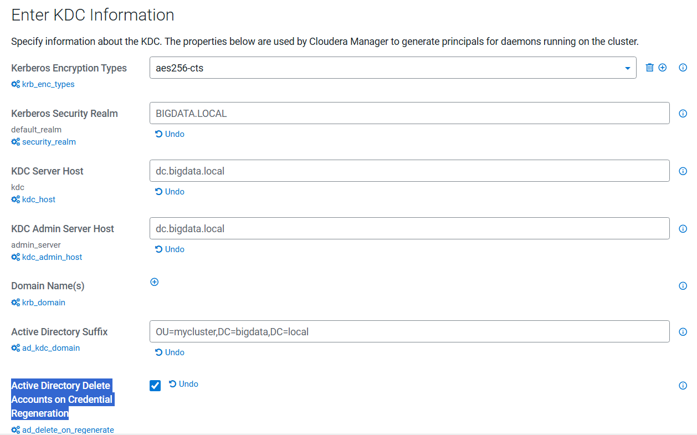
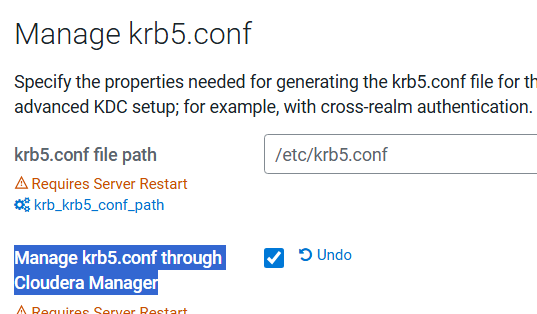
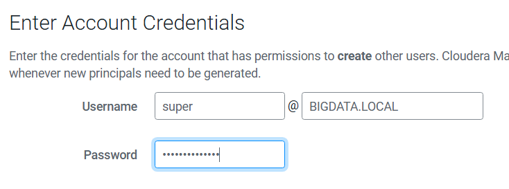
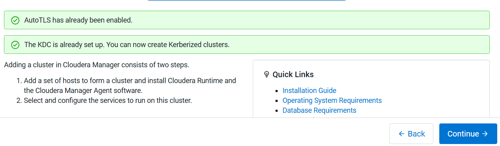

# CDP / Cloudera Platform – Server Preparation (README)

This README documents the baseline software versions and the step-by-step server preparation activities required for the CDP/Cloudera deployment.

> **Scope**
> - All RHEL servers listed in `hosts.csv`
> - Utility server = **Cloudera Manager server** (the jump/automation node)

---

## 1) Software Distributions and Firmware Versions

| Software Component | Version or Release | Host to be Installed |
|--------------------|--------------------|----------------------|
| OS: Red Hat Enterprise Linux Server (RHEL) | 9.5 (Verify with SupportMatrix first) | All Servers |
| OpenJDK | 17.0.14.0.7-1 >= | All Servers |
| Python3 | 3.9 >= | All Servers |
| PostgreSQL DB | 14 >= | Cldr-Mngr |
| Psycopg2-binary | 2.9.11 >= | All Servers |
| Postgres-JDBC-Connector | 42.7.7 >= | All Servers |
| Cloudera Manager | 7.13.1 | Cldr-Mngr |
| Cloudera on premises Base (RunTime) | 7.3.1 | PvC Base Cluster Nodes |
| TLS AutoTLS (Organiztion-CA) | N/A | N/A |
| Kerberos + LDAP + DNS | Active Directory | Windows Server |

---

## 2) Create Admin User with Passwordless Sudo (Run on EACH Server as root)

Create a script on each server and execute it as **root**:

```bash
cat > /tmp/new_user.sh <<'EOF'
#!/bin/bash

USER="cdpadmin"
PASS="P@ssw0rd" # changit

# create user and set password
useradd -m $USER
echo "$USER:$PASS" | chpasswd

# give passwordless sudo
echo "$USER ALL=(ALL) NOPASSWD:ALL" > /etc/sudoers.d/$USER

# fix permissions
chmod 0440 /etc/sudoers.d/$USER

echo "User created with passwordless sudo"
EOF
```
```bash
bash /tmp/new_user.sh
````

> **Note:** Change the default password before production use.

---

## 3) Prepare Utility Server (Cloudera Manager Server)

### 3.1 Create working directory and hosts inventory

```bash
mkdir -p ~/cdp_setup
cd ~/cdp_setup

cat > hosts.csv <<'EOF'
kms1.my.bigdata.local,192.168.1.56
kms2.my.bigdata.local,192.168.1.66
kts1.my.bigdata.local,192.168.1.57
kts2.my.bigdata.local,192.168.1.67
master1.my.bigdata.local,192.168.1.51
master2.my.bigdata.local,192.168.1.52
master3.my.bigdata.local,192.168.1.53
worker1.my.bigdata.local,192.168.1.61
worker2.my.bigdata.local,192.168.1.62
worker3.my.bigdata.local,192.168.1.63
worker4.my.bigdata.local,192.168.1.64
worker5.my.bigdata.local,192.168.1.65
edge1.my.bigdata.local,192.168.1.55
edge2.my.bigdata.local,192.168.1.58
utility2.my.bigdata.local,192.168.1.60
utility1.my.bigdata.local,192.168.1.50
EOF
```

---

## 4) Setup SSH Key-Based Access to All Servers

### 4.1 Generate SSH key

```bash
ssh-keygen
```

### 4.2 Copy SSH key to all servers

```bash
for l in $(cat hosts.csv); do
  fqdn="${l%,*}"
  ssh-copy-id ${fqdn}
done
```

When prompted, enter the password:

```text
P@ssw0rd
```

---

## 5) Make Existing Sudo User Passwordless (If Needed)

If the user already has sudo but is not passwordless (example: user `cdpadmin`), run:

```bash
for l in $(cat hosts.csv); do
  fqdn="${l%,*}"
  ssh -tt $fqdn "echo 'P@ssw0rd' | sudo -S sh -c \"echo 'cdpadmin ALL=(ALL) NOPASSWD: ALL' > /etc/sudoers.d/cdpadmin \""
done
```

---

## 6) Register RHEL Servers (If Subscription Registration is Required)

```bash
for l in $(cut -d, -f1 hosts.csv); do
  ssh -tt "$l" "sudo subscription-manager register --username redhat-user --password 'passssss' "
done
```

> Replace the username/password with valid Red Hat subscription credentials.

---

## 7) Copy Cloudera RHEL Prerequisites Script to All Servers

### 7.1 Copy script to `/tmp`

Ensure `00_cdp_prereq_v1.sh` exists on the utility server in the current directory.

```bash
for l in $(cut -d, -f1 hosts.csv); do
  scp ./00_cdp_prereq_v1.sh ${l}:/tmp/00_cdp_prereq_v1.sh
done
```

### 7.2 Make it executable

```bash
for l in $(cut -d, -f1 hosts.csv); do
  ssh -tt "$l" "sudo chmod a+rwx /tmp/00_cdp_prereq_v1.sh "
done
```

---

## 8) Prepare Log File for Prerequisites Script

```bash
for l in $(cut -d, -f1 hosts.csv); do
  ssh -tt "$l" "sudo touch /tmp/cloudera_prereqs.log && sudo chmod 777 /tmp/cloudera_prereqs.log "
done
```

---

## 9) Run Prerequisites Script on All Servers (Background)

```bash
for l in $(cat hosts.csv); do
  fqdn="${l%,*}"
  ssh "$fqdn" "sudo nohup bash /tmp/00_cdp_prereq_v1.sh > /tmp/cloudera_prereqs.log 2>&1 & "
done
```

---

## 10) Verify Script is Running

```bash
for l in $(cut -d, -f1 hosts.csv); do
  echo "=== $l ==="
  ssh "$l" "ps -ef | grep 00_cdp_prereq_v1.sh | grep -v grep || echo 'NOT RUNNING'"
done
```

---

Here is the continuation section to append after **Step 10** in your existing `README.md`:

---

## 11) Verify Prerequisites on Each Server

After running the prerequisite script, verify that all requirements are satisfied.

Run the following command on each server after copying script:

```bash
./prereq_check.sh
````

Or from the utility server:

Copy script to `/tmp`
```bash
for l in $(cut -d, -f1 hosts.csv); do
  scp ./prereq_check.sh ${l}:/tmp/prereq_check.sh
done
```

Run the script on Each server
```bash
for l in $(cut -d, -f1 hosts.csv); do
  echo "=== Checking $l ==="
  ssh "$l" "sudo bash /tmp/prereq_check.sh"
done
```

This script validates:


Fix any reported issues before continuing.

---

## 12) Download Cloudera Manager Package and Runtime Locally

Cloudera Manager and Runtime parcels must be downloaded and hosted locally using an HTTP repository server.

The **utility1 server** will be used as the local repository server.

---

## 13) Download and Install Cloudera Manager Packages Locally

On the **utility1 server**, run the following script:

```bash
sudo ./local_package.sh   #foreground
```
or 
```bash
sudo nohup bash local_package.sh > httpd._package.log 2>&1 &   #background
```

This script will:

* Install and configure Apache HTTPD
* Download Cloudera Manager RPM packages locally
* Configure the local repository
* Make packages available via HTTP

Example repository location:

```bash
/var/www/html/cloudera-repos/cm7
```

Example repository URL:

```bash
http://utility1.my.bigdata.local/cloudera-repos/cm7
```

> **IMPORTANT**
>
> Edit the script before execution and replace:
>
> * Cloudera username
> * Cloudera password
> * Cloudera Manager version
> * Build numbers
> * Repository paths

---

## 14) Download Cloudera Runtime Parcels Locally

On the **utility1 server**, run:

```bash
./local_parcel.sh  #foreground
```
or 
```bash
sudo nohup bash local_parcel.sh > httpd._package.log 2>&1 &    #background
```
This script will:

* Download Cloudera Runtime parcels
* Download manifest.json
* Place parcels in HTTP repository

Example parcel location:

```bash
/var/www/html/cloudera-repos/cdh7/
```

Example parcel URL:

```bash
http://utility1.my.bigdata.local/cloudera-repos/cdh7/
```

---

## 15) Update Script Variables Before Execution

Before running the scripts, update the following variables inside both scripts:

### In `local_package.sh`

Replace:

```bash
USERNAME="<your_cloudera_username>"
PASSWORD="<your_cloudera_password>"
VERSION="<cloudera_manager_version>"
BUILD="<build_number>"
```

---

### In `local_parcel.sh`

Replace:

```bash
USERNAME="<your_cloudera_username>"
PASSWORD="<your_cloudera_password>"
RUNTIME_VERSION="<runtime_version>"
BUILD_ID="<build_id>"
```

---

## 16) Verify Local Repository is Accessible

After running the scripts, verify repository accessibility:

```bash
curl http://utility1.my.bigdata.local/cloudera-repos/
```

Or open in browser:

```
http://utility1.my.bigdata.local/cloudera-repos/
```

You should see:

* cm/
* cdh7/
* parcels/
* manifest.json

---

Add the following section as **Step 17** in your existing `README.md`, using the same **for-loop distribution method** instead of Ansible:


---

## 17) Download and Distribute PostgreSQL JDBC Connector

Cloudera Manager requires the PostgreSQL JDBC driver to connect to the PostgreSQL database.

This step downloads the driver on the utility server and distributes it to all cluster nodes.

---

### 17.1 Download PostgreSQL JDBC Driver (on utility1 server)

```bash
cd ~/cdp_setup

wget https://jdbc.postgresql.org/download/postgresql-42.7.7.jar
mv -v postgresql-42.7.7.jar postgresql-connector-java.jar
````

### 17.2 Distribute to All Servers

```bash
for l in $(cut -d, -f1 hosts.csv); do
  echo "$l: Create /usr/share/java directory"
  ssh "$l" "sudo mkdir -p /usr/share/java"
  echo "$l: Copy the postgresql JDBC Driver to /tmp"
  scp postgresql-connector-java.jar ${l}:/tmp/postgresql-connector-java.jar
  echo "$l: Move the JDBC Driver from /tmp to /usr/share/java"
  ssh "$l" "sudo mv /tmp/postgresql-connector-java.jar /usr/share/java/postgresql-connector-java.jar"
  echo "$l: Set proper permissions"
  ssh "$l" "sudo chmod 644 /usr/share/java/postgresql-connector-java.jar"
  echo "$l: Verify JDBC Driver"
  ssh "$l" "ls -l /usr/share/java/postgresql-connector-java.jar"
  echo "###########################################################################################"
done
```

---
---

## 18) Install PostgreSQL on utility1 (Cloudera Manager DB)

PostgreSQL will be installed on **utility1** and used as the database backend for Cloudera Manager and related services.

This step installs **PostgreSQL 16** and creates the required databases/users using the provided script.

---

### Copy the Installation Script to utility1 (if needed)

If `postgresql_install.sh` is not already on utility1, copy it:

```bash
sudo ./postgresql_install.sh 
```

Here is the **README.md continuation for Step 19**, assuming the Cloudera Manager packages were already downloaded locally on **utility1** and exposed via HTTP in earlier steps:


## 19) Install and Configure Cloudera Manager Repository on utility1

Cloudera Manager packages were previously downloaded and hosted locally on **utility1** via HTTP.  
This step configures the local repository and installs Cloudera Manager Server.

---

## 19.1 Verify Local Cloudera Repository on utility1


Verify repository is accessible locally:

```bash
curl http://archive.ejada.bigdata.local/cloudera-repos/cm7/7.13.1.700/cm7.13.1.700/
```

Expected: directory listing of Cloudera Manager RPM packages.

---

## 19.2 Create Cloudera Manager Repo File

Create repository configuration file:

```bash
sudo tee /etc/yum.repos.d/cloudera-manager.repo <<EOF
[cloudera-manager]
name=Cloudera Manager
baseurl=http://archive.ejada.bigdata.local/cloudera-repos/cm7/7.13.1.700/cm7.13.1.700/
gpgcheck=0
enabled=1
EOF
```

---

## 19.3 Clean and Refresh YUM Cache

```bash
sudo dnf clean all
sudo dnf makecache
sudo dnf repolist
```

Expected output should include:

```text
cloudera-manager
```

---

## 19.4 Install Cloudera Manager Server and Agent

Install Cloudera Manager Server, Agent, and Daemons:

```bash
sudo dnf install -y cloudera-manager-server cloudera-manager-agent cloudera-manager-daemons
```

---

## 19.5 Verify Installation

Verify installed packages:

```bash
rpm -qa | grep cloudera-manager
```

Expected example output:

```text
cloudera-manager-server-7.13.1...
cloudera-manager-agent-7.13.1...
cloudera-manager-daemons-7.13.1...
```

---

## 20) Configure Cloudera Manager Database and Start Services

This step prepares the Cloudera Manager database using PostgreSQL 16, updates the agent configuration, and starts the Cloudera Manager services.

Run all commands on **utility1.my.bigdata.local** (Cloudera Manager server).

---

## 20.1 Prepare Cloudera Manager Database

Run the following command using the PostgreSQL database name, username, and password created earlier:

```bash
sudo /opt/cloudera/cm/schema/scm_prepare_database.sh postgresql scm scm scm@123
sudo cat /etc/cloudera-scm-server/db.properties 
````

Expected output:

```properties
com.cloudera.cmf.db.type=postgresql
com.cloudera.cmf.db.host=utility1.my.bigdata.local
com.cloudera.cmf.db.name=scm
com.cloudera.cmf.db.user=scm
com.cloudera.cmf.db.password=<POSTGRES_PASSWORD>
com.cloudera.cmf.db.setupType=EXTERNAL
```

---

## 20.2 Update Cloudera Manager Agent Configuration

Update agent configuration to point to Cloudera Manager hostname:

```bash
sudo sed -i 's/server_host=localhost/server_host=utility1.my.bigdata.local/g' /etc/cloudera-scm-agent/config.ini
```

Verify:

```bash
grep server_host /etc/cloudera-scm-agent/config.ini
```

Expected:

```text
server_host=utility1.my.bigdata.local
```

---

## 20.3 Restart Cloudera Manager Agent

```bash
sudo systemctl restart cloudera-scm-server cloudera-scm-agent
```

---

## 20.4 Monitor Cloudera Manager Server Logs (Live)

Monitor startup logs:

```bash
sudo tail -f /var/log/cloudera-scm-server/cloudera-scm-server.log
```

## 20.6 Access Cloudera Manager Web UI

Open browser:

```
http://utility1.my.bigdata.local:7180
```

Default credentials:

```
Username: admin
Password: admin
```


## 21) Accept License + Enable AutoTLS (Case 3: External CA / Custom Certs)

In this deployment we will enable **AutoTLS using Case 3** (Custom CA = external signing).
Flow:
1) Generate CSR and private key for each host  
2) Sign certificates using your organization CA  
3) Place certs/keys in the required paths  
4) Trigger AutoTLS Case 3 API call

> Run these steps on **utility1** (Cloudera Manager server).

---

## 21.1 Accept Cloudera License (Web UI)

## 21.2 Generate CSR and Private Keys (Case 3)

Run your CSR generation script:

```bash
./generate_csr.sh
````

Expected output (example):

* CSR files for each hostname
* Private keys for each hostname

Keep private keys secure.

---

## 21.3 Sign Certificates (Org CA) and Place Files in Required Paths

After CSR signing by your organization CA, place the files exactly as below:

* Host certificates:

  * `/tmp/auto-tls/certs/<hostname>.cer`
* Host keys:

  * `/tmp/auto-tls/keys/<hostname>-key.pem`
* CA chain:

  * `/tmp/auto-tls/certs/chain.pem`
* Root CA (trusted CA cert):

  * `/tmp/auto-tls/RootCA.cer`
* Password files:

  * `/tmp/auto-tls/keys/key.pwd`

> Ensure permissions allow CM to read these files.

---

## 21.4 AutoTLS Case 3 prereq

```bash
sudo mkdir /opt/cloudera/AutoTLS
sudo chown -R  cloudera-scm:cloudera-scm /opt/cloudera/AutoTLS
sudo chown -R  cloudera-scm:cloudera-scm /tmp/auto-tls/
```

---

## 21.5 Run AutoTLS Case 3 Script

```bash
./autotls3.sh
```

Expected:

* CM returns HTTP response with a command ID
* CM will distribute certs and enable TLS for CM + services

---

## 21.6 Monitor CM Server Log During AutoTLS

```bash
sudo tail -f /var/log/cloudera-scm-server/cloudera-scm-server.log
sudo systemctl restart cloudera-scm-server 
```

---

## 21.7 Validate CM Web UI After AutoTLS

After AutoTLS completes, CM may switch to HTTPS (depending on configuration).

Try:

* HTTP:

  * `http://utility1.my.bigdata.local:7180`
* HTTPS:

  * `https://utility1.my.bigdata.local:7183`




## 22) Configure Kerberos Authentication Using Active Directory KDC

This step integrates Cloudera Manager with Microsoft Active Directory to enable Kerberos authentication for secure service communication.

Kerberos will use Active Directory as the KDC.


## 22.1 Kerberos / Active Directory Configuration Parameters

Use the following values:

| Parameter | Value |
|---------|------|
| Kerberos Security Realm | BIGDATA.LOCAL |
| KDC Server Host | dc.bigdata.local |
| KDC Admin Server Host | dc.bigdata.local |
| Kerberos Admin Principal | super@BIGDATA.LOCAL |
| Active Directory OU | OU=mycluster,DC=bigdata,DC=local |
| Active Directory Domain | bigdata.local |
| Active Directory Delete Accounts on Credential Regeneration | Enabled |
| krb5.conf path | /etc/krb5.conf |
| Manage krb5.conf via Cloudera Manager | Enabled |

---







---

## 22.2 Verify Kerberos Configuration

After deployment, verify Kerberos ticket generation on a cluster node:

```bash
sudo systemctl restart cloudera-scm-server
kinit super@BIGDATA.LOCAL
```

Enter password.

Verify ticket:

```bash
klist
```

Expected output:

```text
Ticket cache: FILE:/tmp/krb5cc_...
Default principal: super@BIGDATA.LOCAL
```

---



## Next Step


```


